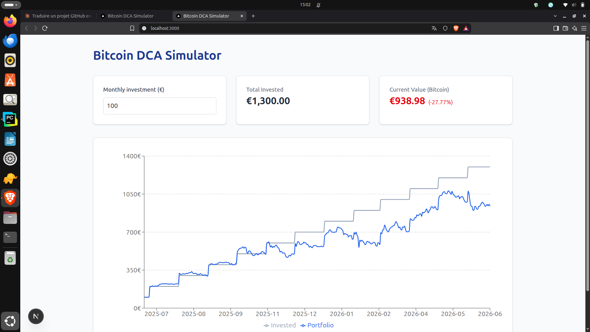

# Bitcoin DCA Simulator

An interactive tool that shows how a **monthly Bitcoin dollar-cost averaging (DCA)** strategy would have performed, using real historical prices.

**Live demo:** https://project-12bry.vercel.app/



> ⚠️ **Disclaimer:** This project is for **educational purposes only** and is not financial advice. Past performance does not guarantee future results. Cryptocurrencies are highly volatile assets, and you can lose part or all of your investment. The simulation ignores fees, taxes and slippage.

## Features

- Choose a monthly investment amount and see the result instantly
- Compare the total amount invested with the portfolio value over time
-(venv) administrateur@Jeremy:~/simulateur_sinvestir$ nano backend/schema.sql 


(venv) administrateur@Jeremy:~/simulateur_sinvestir$ 
(venv) administrateur@Jeremy:~/simulateur_sinvestir$ 
(venv) administrateur@Jeremy:~/simulateur_sinvestir$  See the return on investment (green if positive, red if negative)
- Prices stored in a database and refreshed automatically every day

## Tech Stack

| Layer | Technology |
| --- | --- |
| Frontend | Next.js, React, Tailwind CSS, Recharts |
| Database | Supabase (PostgreSQL) |
| Data ingestion | Python, CoinGecko API |
| Automation | GitHub Actions (daily cron) |
| Hosting | Vercel |

## How It Works

1. A Python script fetches daily Bitcoin prices (in EUR) from CoinGecko and upserts them into Supabase.
2. The frontend reads the prices from Supabase once, when the page loads.
3. The DCA calculation runs entirely in the browser: on the first available day of each month, a fixed amount is invested, and the portfolio is valued at each day's price.

**Good to know:** the free CoinGecko API limits the available history (365 days at the time of writing), so the simulation covers a rolling window of about one year. Because the window rarely starts on the first of a month, it can include 13 calendar months, the first and last being partial.

## Project Structure

```
.
├── backend/
│   ├── ingest_crypto.py      # Fetches prices and upserts them into Supabase
│   ├── requirements.txt
│   ├── schema.sql            # Database table and security policies
│   └── .env.example
├── frontend/
│   ├── src/app/              # Next.js app (page, layout, styles)
│   └── .env.example
└── .github/workflows/
    └── update-prices.yml     # Daily data refresh
```

## Getting Started

### Prerequisites

- Node.js 20+ and npm
- Python 3.10+
- A free [Supabase](https://supabase.com) project

### 1. Set up the database

In the Supabase SQL editor, run the contents of [`backend/schema.sql`](backend/schema.sql). It creates the `historical_prices` table and enables Row Level Security with a read-only public policy.

### 2. Load the data (backend)

```bash
cd backend
python3 -m venv venv
source venv/bin/activate
pip install -r requirements.txt

export SUPABASE_URL="https://your-project.supabase.co"
export SUPABASE_SERVICE_ROLE_KEY="your-service-role-key"
python ingest_crypto.py
```

> 🔒 The `service_role` key bypasses Row Level Security. Use it **only** in the backend or in CI secrets. **Never** expose it in the frontend or commit it.

### 3. Run the frontend

```bash
cd frontend
cp .env.example .env.local   # then fill in your values
npm install
npm run dev
```

Open http://localhost:3000. The frontend needs the project URL and the **anon** (public) key:

```
NEXT_PUBLIC_SUPABASE_URL=https://your-project.supabase.co
NEXT_PUBLIC_SUPABASE_ANON_KEY=your-anon-key
```

## Automated Data Updates

The workflow in [`.github/workflows/update-prices.yml`](.github/workflows/update-prices.yml) runs `ingest_crypto.py` every day and can also be triggered manually from the **Actions** tab. Because the script upserts on `date`, it is safe to run repeatedly.

To enable it in your own fork, add two repository secrets under **Settings → Secrets and variables → Actions**: `SUPABASE_URL` and `SUPABASE_SERVICE_ROLE_KEY`.

## Roadmap

- [ ] Support more cryptocurrencies and currencies
- [ ] Configurable period and investment frequency (weekly, monthly)
- [ ] Compare DCA with a lump-sum investment
- [ ] Unit tests for the DCA calculation (Vitest)
- [ ] Longer price history from an additional data source
- [ ] Export the simulation as a PDF

## Author

Built by Jérémy Lebrun ([@Mountainbluesun](https://github.com/Mountainbluesun)).